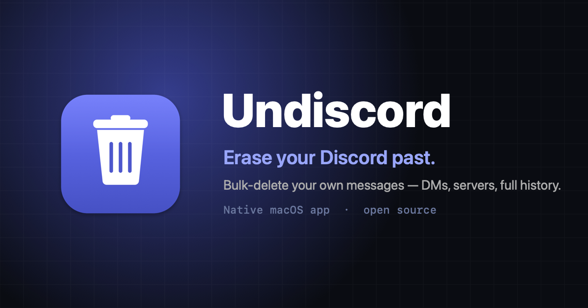

<p align="center">
  
</p>

<h1 align="center">Undiscord</h1>

<p align="center">
  <b>A native macOS app to bulk-delete your own Discord messages.</b><br>
  DMs, friends, servers — or your entire history via data-package import. Multiselect,<br>
  self-throttling, and fully local: your token never leaves your Mac.
</p>

<p align="center">
  <a href="https://github.com/josemsalcedoq/undiscord-macos/actions/workflows/ci.yml"></a>
  <a href="https://github.com/josemsalcedoq/undiscord-macos/releases/latest"></a>
  
  
  <a href="https://github.com/josemsalcedoq/undiscord-macos/releases/latest/download/Undiscord.dmg"></a>
</p>

<p align="center">
  <a href="https://josemsalcedoq.github.io/undiscord-macos/"><b>Website</b></a> ·
  <a href="https://github.com/josemsalcedoq/undiscord-macos/releases/latest/download/Undiscord.dmg"><b>Download DMG</b></a> ·
  <a href="#usage"><b>Usage</b></a> ·
  <a href="#faq"><b>FAQ</b></a>
</p>

---

> [!WARNING]
> This deletes **your own** messages using **your account token**. Automating a user account is
> **against Discord's Terms of Service** and can, in principle, get an account actioned —
> *regardless of how slow you go*. The delays reduce rate-limit bans, **not** ToS risk. Deletion is
> **permanent**. Use it on your own account, at your own risk. Not affiliated with Discord.

## Contents

- [Why](#why) · [Features](#features) · [Download & install](#download--install) · [Usage](#usage)
- [Data-package import](#data-package-import) · [Rate limiting & safety](#rate-limiting--safety)
- [How it works](#how-it-works) · [Project layout](#project-layout) · [Development](#development)
- [FAQ](#faq) · [Credits](#credits) · [License](#license)

## Why

The original [Undiscord](https://github.com/victornpb/undiscord) is a browser userscript: powerful,
but you install a userscript manager and paste channel/guild IDs by hand, one conversation at a time.

**Undiscord (this app)** is a self-contained macOS app that:

- **finds your conversations for you** — DMs, friends, and servers, with avatars, ready to multiselect;
- reaches **history the API won't even list** — closed DMs and left groups — by importing your Discord data package;
- keeps the battle-tested **rate-limit engine** and hardens it with enforced minimum delays;
- runs entirely **on your machine**, in your real Discord session — no extension, no server, no telemetry.

## Features

| | |
|---|---|
| **Multiselect discovery** | Auto-loads your open DMs, friends (even with closed DMs), and servers. Filter, tick, go. |
| **Full-history import** | Import your Discord Data Package `.zip` to delete every DM/group you've ever had. |
| **Preview before you delete** | *Scan counts* shows how many of your messages are in each target first. |
| **Self-throttling engine** | Adaptive `429` back-off, un-indexed-channel handling, and **enforced minimum delays**. |
| **Live progress + stop** | A running log and progress bar; stop any time. |
| **Private by design** | Your token is never written to disk or sent anywhere. No account, no server. |

## Download & install

1. Download **[`Undiscord.dmg`](https://github.com/josemsalcedoq/undiscord-macos/releases/latest/download/Undiscord.dmg)** from the [latest release](https://github.com/josemsalcedoq/undiscord-macos/releases/latest).
2. Open the DMG and drag **Undiscord** to **Applications**.
3. The app is **unsigned / un-notarized** (no paid Apple Developer account), so on first launch:
   **right-click the app → Open**, then confirm — or allow it in **System Settings → Privacy & Security**.

Prefer to build it yourself? See [Development](#development).

## Usage

1. Launch **Undiscord** and **log in to Discord** in the window (a sandboxed web view running the real
   web client). Your login persists between launches.
2. Click the **🗑️ button** (bottom-right). It grabs your session and loads your conversations.
3. Choose a tab, filter, and **check** what to clean:
   - **Direct Messages** — open DMs **and** friends (friends' DMs are opened on demand). Groups included.
   - **Servers** — deletes your messages across every channel of that server.
   - **Imported** — everything from your data package (see below).
4. *(Recommended)* **Scan counts** to preview how many messages each target holds.
5. **Delete selected** → confirm. Watch the progress bar and log. **Stop** halts after the current message.

## Data-package import

Discord's API only exposes DMs you currently have **open**, plus your friends. To reach *everything* —
DMs you closed, one-off conversations, groups you left — import your **Discord Data Package**:

1. In Discord: **Settings → Data & Privacy → Request all of my Data** (it arrives by email in a few days).
2. In the app: **Imported** tab → **Import Data Package…** (or **File → Import Data Package…**) and pick the `.zip`.
3. The app parses `messages/` (JSON or CSV), lists every DM/group with its message count, and deletes
   **directly by message ID** — no search required, so it works even for conversations you can't reopen.

The package only ever contains **your own** messages, so this can only delete what you sent.

## Rate limiting & safety

Discord's search and delete routes throttle aggressively. The engine (ported from Undiscord and hardened):

- runs deletions **serially** with a delay between each, and a longer delay between search pages;
- **backs off on `429`**: reads `retry_after`, raises the delay, waits `2×`, and retries;
- waits out **un-indexed channels** (`202`) and **skips** messages it can't delete (archived threads, system messages);
- enforces **hard minimum delays you cannot lower** — because faster traffic gets you throttled and looks automated:

| Setting | Default | Enforced minimum |
|---|--:|--:|
| Search delay | 30000 ms | **2000 ms** |
| Delete delay | 1000 ms | **700 ms** |

None of this makes the activity ToS-compliant — see the warning at the top. It only reduces *rate-limit* bans.

## How it works

```
┌─ Undiscord.app (Swift / AppKit) ───────────────────────────────┐
│  WKWebView  →  loads discord.com/app  (your real session)      │
│     │                                                          │
│     ├─ injects undiscord.js as a WKUserScript (bypasses CSP)   │
│     │     • discovers DMs/friends/servers, multiselect UI      │
│     │     • rate-limited search + delete engine                │
│     │                                                          │
│     └─ WKScriptMessageHandler bridge                           │
│           • "import" → NSOpenPanel → UndiscordCore parser      │
└────────────────────────────────────────────────────────────────┘
```

- **`WKWebView`** loads the real Discord web client; login persists via the default data store.
- The panel is injected as a **`WKUserScript`**, which is *not* subject to Discord's CSP (that's why a
  bookmarklet can't do this). The same file exports its engine for Node tests.
- A **native bridge** handles data-package import; the parsing lives in a pure `UndiscordCore` Swift
  library with **no AppKit dependency**, so it's unit-tested in isolation.

## Project layout

```
undiscord-macos/
├─ docs/                      # GitHub Pages landing site (index.html, icon.png, og.png)
├─ mac-app/
│  ├─ Package.swift           # SwiftPM: UndiscordApp (exe) + UndiscordCore (lib) + tests
│  ├─ Sources/UndiscordApp/
│  │  ├─ main.swift           # window, web view, JS dialogs, import bridge
│  │  └─ undiscord.js         # injected panel UI + rate-limited delete engine (source of truth)
│  ├─ Sources/UndiscordCore/
│  │  └─ PackageParser.swift  # pure data-package parser (unit-tested)
│  ├─ Tests/… (Swift)  ·  js-tests/… (Node)
│  ├─ bundle.sh · make-dmg.sh # build Undiscord.app / Undiscord.dmg
│  └─ icon/                   # icon + OG image generators
└─ .github/workflows/         # ci.yml (tests), release.yml (DMG, manual)
```

## Development

```sh
cd mac-app
swift run                       # build & launch the app (dev)
swift test                      # Swift tests — data-package parser
node --test js-tests/*.test.js  # JS tests — engine (mocked fetch): rate-limit, search, delete, id-list
./bundle.sh                     # → Undiscord.app  (icon + ad-hoc signature)
./make-dmg.sh                   # → Undiscord.dmg  (drag-to-Applications installer)
```

**CI** ([`ci.yml`](.github/workflows/ci.yml)) runs the JS and Swift test suites on every push and PR.
**Releases** are cut locally under the owner's identity; [`release.yml`](.github/workflows/release.yml)
can also build the DMG on demand (`workflow_dispatch`).

## FAQ

<details>
<summary><b>Will I get banned?</b></summary>

Possibly. Automating a user account violates Discord's ToS, and that risk exists no matter how slow you
go. The rate limiter avoids *rate-limit* bans (429 storms); it does not make the activity ToS-compliant.
Deleting your own messages this way is common but never risk-free — decide accordingly.
</details>

<details>
<summary><b>Can it delete other people's messages?</b></summary>

No. It authenticates as you, so it can only delete messages you sent. The data package it imports also
only contains your own messages.
</details>

<details>
<summary><b>What about DMs I closed, or people I'm not friends with?</b></summary>

Use the <b>Imported</b> tab with your Discord Data Package — that's the only complete source of your DM
history, including closed DMs and left groups.
</details>

<details>
<summary><b>Is my token or data sent anywhere?</b></summary>

No. No server, no telemetry. Everything runs locally in your own Discord session; your token is never
written to disk or transmitted to a third party.
</details>

## Credits

Rate-limit engine, search/delete mechanics, and the token-grab technique are adapted from
**[victornpb/undiscord](https://github.com/victornpb/undiscord)** (MIT). The native macOS app,
multiselect discovery, data-package import, and landing site are new.

## License

[MIT](LICENSE) © 2026 josemsalcedoq. Not affiliated with or endorsed by Discord Inc.
